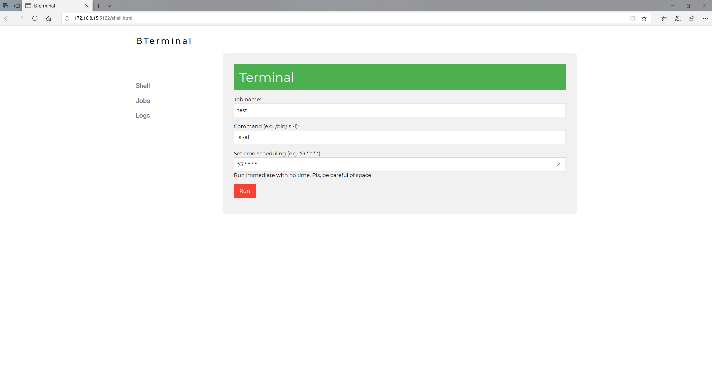
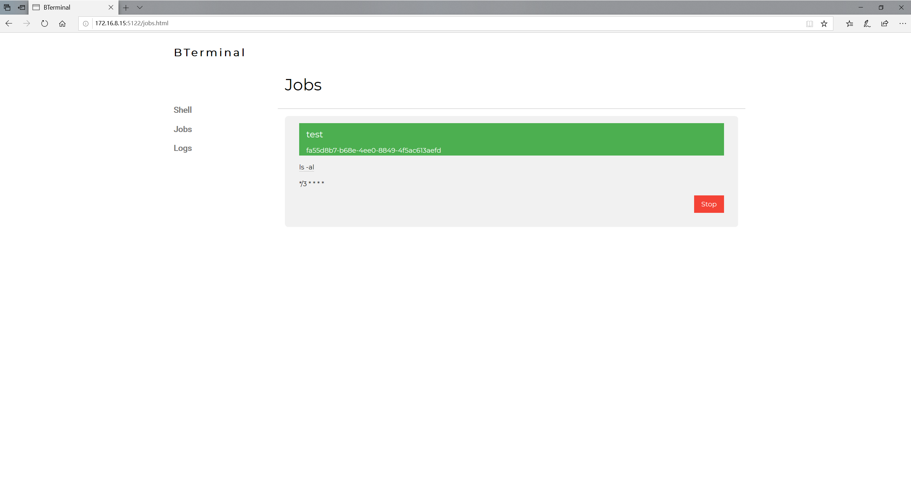

# BTerminal

English | [中文](./README_CN.md)

A simple tool executes command with or without schedule.
It is self-hosted web service without dependencies.
It is based on golang, can run on any operating system, including Windows.

## Installation

## Features

- Password protection
- Execute single command on web browser, running on background service.
- Cron Scheduling on all operating system, including Windows.
  - [cron wiki](https://en.wikipedia.org/wiki/Cron)
- Cookie sessions and single tokens are trying to improve http security.

## Getting Started

### Run

### Usage

## Figures

Figure 1: Password index page

Password protection can be setted by config or cli command
and will be encoded by Base64

Figure 2: UI of Single Command Entering

The command is required and the name and cron scheduling can be empty.
The command will execute immediately when cron scheduling is empty.
Strongly recommend
that shell script or python handle multiple commands input.

The reason why I want to create this tool is
the international bandwidth has limited by home using with some reason.
but the bandwidth will be less QoS around four in the morning.
So, I can update content or do some task in Windows or linux at that time.

Figure 3: display cron tasks

Figure 4: display all tasks' log

## TODO

- [ ] delete log and stop jobs
- [ ] recovery jobs
- [ ] recovery logs
- [ ] test wrong format cron
- [ ] test on Windows, MacOs
- [ ] develop new web interface or a software UI

## Contributing

If you are interested, really welcome to get involved.

- if you encounter a bug, issue it first.
- if you have an idea or problem, feel free to post it on issue.
- if you can contribute code,
pls sending Pull Request to `dev branch`.
