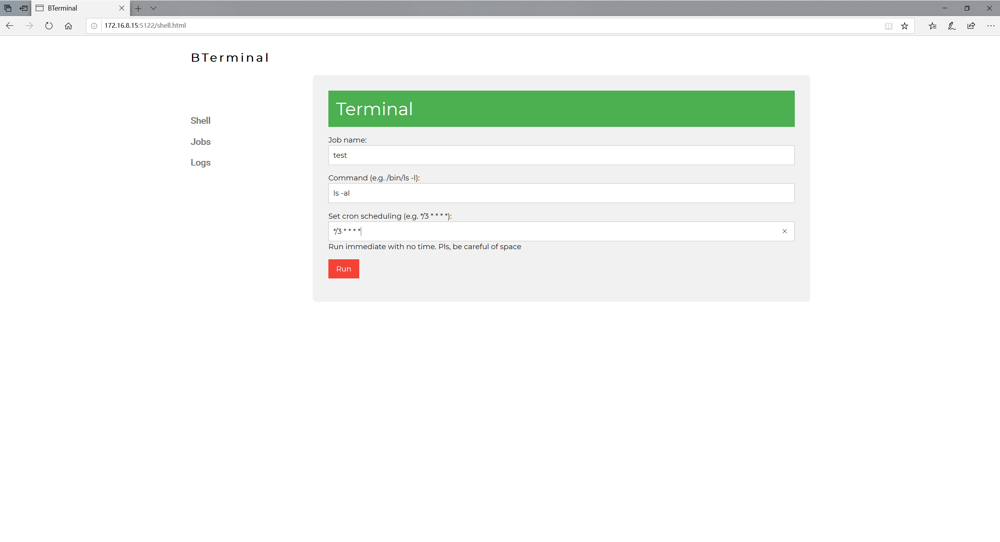
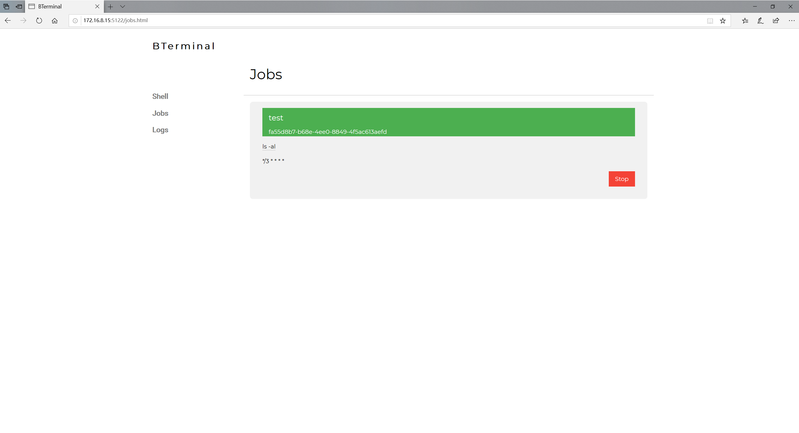
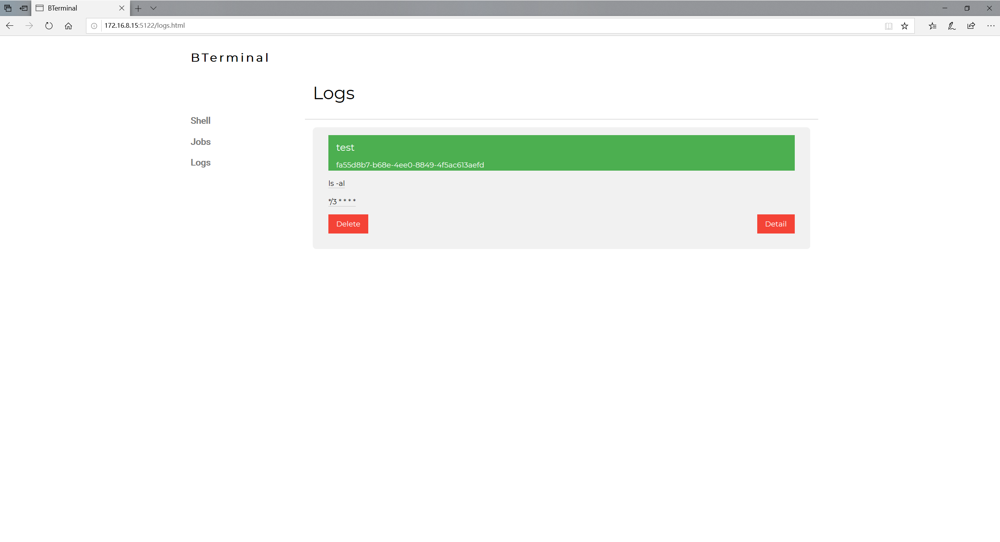

# BTerminal

[English](./README.md) | 中文

这个是用来定时运行命令的小工具，不需要任何依赖就能部署的网页服务。
它用纯go语言编写的，可以在任何操作系统上运行，尤其是Windows。

## 安装

## 功能

- 密码保护
- 网页服务
- Cron 任务
  - 详见[维基](https://en.wikipedia.org/wiki/Cron)
- 利用Cookie的单点登录和单次form操作来提升http安全性

## 开始使用

### 运行

### 使用

## 图表

图1：密码页面

密码可以在config和命令行上设置，而且用Base64来编码

图2：输命令的页面

其中的命令是必须的而任务的名字和cron时间可以不填。
如果不填，会直接生效。
建议使用shell脚本或者python来处理多个命令。

图3: cron任务

图4: 日志

## TODO

- [x] delete log and stop jobs
- [ ] recovery jobs
  - [x] done
  - [ ] test
- [ ] recovery logs
  - [x] done
  - [ ] test
- [ ] test wrong format cron
- [ ] test on Windows, MacOs
- [ ] make windows installer
- [ ] deb package
- [ ] 新的网页UI或者软件UI

## 贡献

非常欢迎你参与到这个工具的搭建

- 如果你遇到了bug，请先贴到issue上
- 如果你有新的想法或者问题，请随意发到issue上
- 如果你能贡献代码，请向dev分支提交Pull Request
