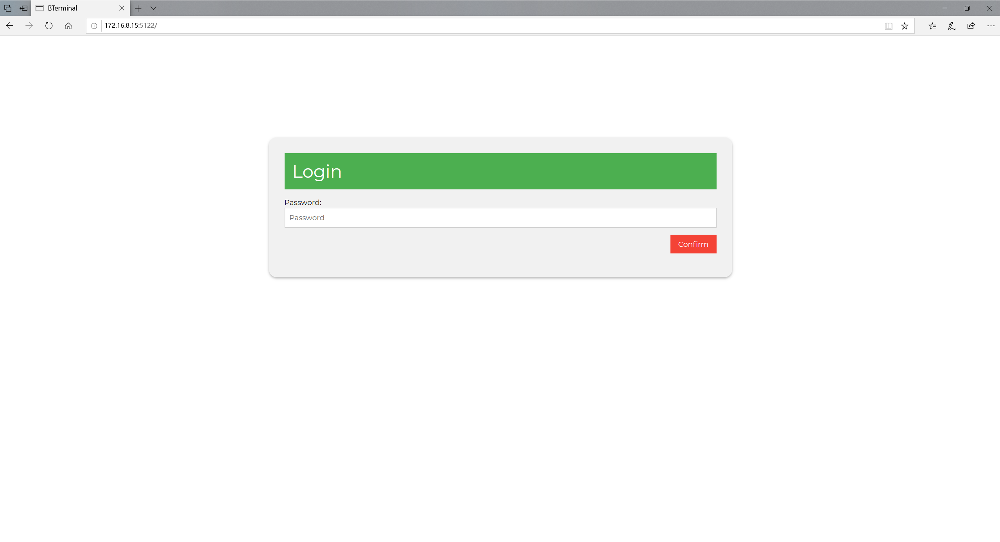

# BTerminal

[English](./README.md) | 中文

这个是用来定时运行命令的小工具，不需要任何依赖就能部署的网页服务。
它用纯go语言编写的，可以在任何操作系统上运行，尤其是Windows。

## 安装

``` sh
go get github.com/wutaosamuel/bterminal/cmd/bterminal
```

或者

``` sh
# debian/ubuntu
dpkg -i bterminal-1.0-1.deb
```

或者

``` sh
# windows
# use after setup
bterminal-1.0-1.exe
```

## 功能

- 密码保护
- 网页服务
- Cron 任务
  - 详见[维基](https://en.wikipedia.org/wiki/Cron)
- 利用Cookie的单点登录和单次form操作来提升http安全性

## 开始使用

### 运行

#### 简单运行

``` sh
# Linux
bterminal
```

``` sh
# Windows
1. bterminal.msi
2. 点击右下角系统托盘中bterminal的开始选项
```

网络端口，密码和日志路径是可以用命令行命令里改变的。详情 bterminal -h | help。
如果你的程序是由windows安装工具下载的，可以在C:/ProgramData/bterminal/config.json里改变上述三项变量。

### 使用

``` sh
# 在浏览器中管理任务
127.0.0.1:5122
```

## 图表

图1：密码页面

密码可以在config和命令行上设置，而且用Base64来编码



图2：输命令的页面

其中的命令是必须的而任务的名字和cron时间可以不填。
如果不填，会直接生效。
建议使用shell脚本或者python来处理多个命令。


图3: cron任务


图4: 日志


## TODO

- [ ] -c, --clean: clean GobData.dat, html/logs.html, html/jobs.html
- [ ] restart a stopped job
- [ ] test wrong format cron
- [ ] test on Windows
- [ ] test on MacOs
- [ ] a log for watching the whole program
- [ ] limit log length on web interface
- [x] make windows installer
- [x] deb package
- [ ] support go mod (currently, fail on uuid)
- [ ] 新的网页UI或者软件UI

## 库

- github.com/patrickmn/go-cache
- github.com/satori/go.uuid
- github.com/robfig/cron

## 贡献

非常欢迎你参与到这个工具的搭建

- 如果你遇到了bug，请先贴到issue上
- 如果你有新的想法或者问题，请随意发到issue上
- 如果你能贡献代码，请向dev分支提交Pull Request
